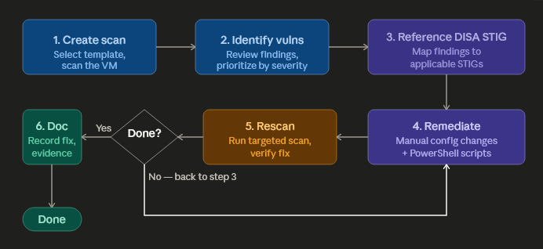

<h1>Windows 11 STIG Remediation Repository </h1>
This project showcases the process of finding and remediating vulnerabiltes. DISA STIG in this case refers to the Security Technical Implementation Guides published by the Defense Information Systems Agency (DISA). The guides can be used to configure devices (Windows OS, web servers, routers, etc.) to minimize the attack surface.

<h2>Table of Contents</h2>
1. [Project Overview](#project-overview) 
2. [Remediation Workflow](#remediation-workflow) 
3. [Initial Nessus Scan Results](#initial-scan-results) 
4. [Implemented STIG Controls](#implemented-stig-controls) 
5. [Remediation Script Repository](#remediation-script-repository) 
6. [Post-Remediation Testing](#post-remediation-testing) 
6. [Ongoing Vulnerability Management](#ongoing-vulnerability-management) 

<h2>Project Overview</h2>
- Purpose: Demonstrate the process of scanning a Windows 11 VM with Nessus using a template, indentifying STIG findings, remediating them with Powershell and manually, finally verifying the vulnerability has been remediated. 
- Scope: Windows 11 VM

<h2>Remediation Workflow</h2>

1. <b>Create the Nessus Scan:</b> Select the template, configure the target scope (Windows 11 VM for this project), and then scan the device(s). 
2. <b>Identify Vulnerabilites:</b> For this project 10 vulnerabilies are identified for remediation. 
3. <b>Reference DISA STIG documentation:</b> 
4. <b>Remediate:</b> 
5. <b>Rescan to Verify:</b>Run a scan on the device that the changes were applied to and confirm the vulnerabilites have been remediated. 
&emsp;-If remediated <b>successfully</b> -> proceed to Step 6. 
&emsp;-If <b>not successfully</b> remediated -> returnd to step 3 and re-evaluate approach. 
7. <b>Document the Remediation:</b>
   

<h2>Initial Nessus Scan Results</h2>

##<h2>Implemented STIG Controls</h2>
This table lists the identified vulernabilites by their STIG ID, a summary of the vulnerabilities, and a link to the documentation.
<table>
<tr>
<th>STIG ID(s)</th>
<th>Summary</th>
<th>Link</th>
</tr>

<tr>
<td>WN11-UR-000010</td>
<td>The 'Access this computer from the network' user right must only be assigned to the Administrators and Remote Desktop Users groups.</td>
<td><a href="/STIGGUIDES/secureRemoteAccess.md">Remote Access</a></td>
</tr>

<tr>
<td>WN11-00-000030</td>
<td>Windows 11 information systems must use BitLocker to encrypt all disks to protect the confidentiality and integrity of all information at rest.</td>
<td><a href="docs/TEST.md">ToDo</a></td>
</tr>

<tr>
<td>WN11-00-000135</td>
<td>A host-based firewall must be installed and enabled on the system.</td>
<td><a href="docs/TEST.md">ToDo</a></td>
</tr>

<tr>
<td>WN11-AU-000500</td>
<td>The Application event log size must be configured to 32768 KB or greater.</td>
<td><a href="docs/TEST.md">ToDo</a></td>
</tr>

<tr>
<td>WN11-AU-000054</td>
<td>The system must be configured to audit Logon/Logoff - Account Lockout failures.</td>
<td><a href="docs/TEST.md">ToDo</a></td>
</tr>

<tr>
<td>WN11-AC-000010</td>
<td>The number of allowed bad logon attempts must be configured to three or less.</td>
<td><a href="/STIGGUIDES/accountLockoutThreshold.md">Lockout Threshold</a></td>
</tr>

<tr>
<td>WN11-AC-000035</td>
<td>Passwords must, at a minimum, be 14 characters.</td>
<td><a href="docs/TEST.md">ToDo</a></td>
</tr>

<tr>
<td>WN11-CC-000150</td>
<td>The user must be prompted for a password on resume from sleep (plugged in).</td>
<td><a href="docs/TEST.md">Remote Access</a></td>
</tr>

<tr>
<td>WN11-AU-000588</td>
<td>Windows 11 must be configured to audit sensitive privilege use failures.</td>
<td><a href="docs/TEST.md">Remote Access</a></td>
</tr>

<tr>
<td>WN11-AC-000030</td>
<td>The minimum password age must be configured to at least 1 day.</td>
<td><a href="docs/TEST.md">Remote Access</a></td>
</tr>

</table>

##<h2>Remediation Script Repository</h2>

##<h2>Post-Remediation Testing</h2>

##<h2>Ongoing Vulnerability Management</h2>
